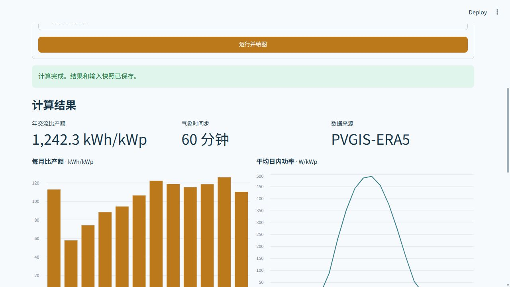

# PVGIS + pvlib Rooftop PV Calculator

[中文说明](README.md) · [Skill](SKILL.md) · [Parameters](references/parameters.md)

A local Streamlit dashboard and CLI for requesting PVGIS TMY weather, modeling AC photovoltaic yield with pvlib, and optionally aggregating rooftop capacity and annual generation from a building CSV. All inputs that affect a result are explicit in the scenario configuration. Each run saves its configuration, data snapshots, source metadata, and hashes.



The screenshot shows a **reference 1 kWp PV system**, using real PVGIS-ERA5 TMY weather and the repository's example system parameters. The sample building areas, roof factors, shading factors, and carbon factor are synthetic. This is not a Guangzhou citywide potential estimate.

## Thesis case study: aggregate results only

For the main assessment boundary excluding urban-village residences, the author's current Guangzhou thesis draft reports **177.94 km²** of suitable rooftop area, **37.37 GWp** of technical DC capacity, **43.35 TWh/year** of typical-year generation potential, and **19.15 Mt CO₂/year** of estimated operational emission reductions. An additional **10.73 TWh/year** from urban-village residences is a separately reported conditional reserve. These thesis totals cannot be reproduced from this repository's synthetic building example. See the [scope note](docs/thesis-aggregate-results.md). No thesis manuscript or building-level research data is included.

## Quick start

Python 3.10+ is required. From the repository root:

```bash
python -m venv .venv
python -m pip install -e ".[weather,web]"
python -m streamlit run web/app.py
```

Open the local address printed by Streamlit, usually `http://127.0.0.1:8501`. On Windows, use `.venv\Scripts\python.exe` for `python`, or double-click `启动网页.cmd` after installing dependencies. The web server binds to loopback only.

The **Yield** mode needs no building data. The **Building generation** mode accepts an uploaded CSV or local CSV path and reports separate assessment scopes. The form exposes PVGIS selection, PV module and inverter settings, area factors, column mappings, corrections, and optional operational carbon factor. Monthly, diurnal and daily plots are generated from the computed time series.

CLI examples:

```bash
python scripts/pv.py yield --config examples/pvgis-yield.json --output outputs/yield-example
python scripts/pv.py run --config examples/pvgis-tmy.json --output outputs/buildings-example
python -m unittest discover -s tests -q
```

PVGIS TMY does not expose a radiation-database selection argument; the tool records and can assert the database actually returned. The example asserts `PVGIS-ERA5`. A configured effect already included in the yield cannot be multiplied again under the same effect ID.

The repository is also an agent skill named **`pvgis-pvlib-rooftop-pv`**. Its entrypoint is [SKILL.md](SKILL.md); keep the whole repository with the skill so its scripts and examples remain available.

The software is [MIT licensed](LICENSE). Read [THIRD_PARTY.md](THIRD_PARTY.md) for dependencies and data provenance. GIS geometric shading, storage dispatch, project economics, and grid connection are outside the current calculation scope.
